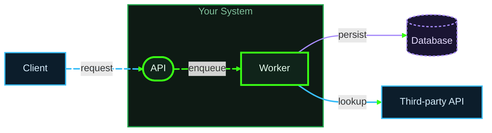

# Diagram Theme — Neon Green on Dark

Standard Mermaid theme for architecture diagrams in this repo. Not tied to any one
system — use it for pipelines, service maps, data flows, state machines, deployment
topologies, whatever comes next.

## The one rule

**Hue means position in the architecture. It never means health.**

Green is the system you are describing. Blue is everything outside it. Violet is state
that persists. Gray is out of scope.

Amber and red are held back for status — degraded, failing — and appear only when a
diagram is actually about status. If you color a normal external dependency amber, it
reads as "this thing is in a warning state," and the reader spends attention on an alarm
you never meant to raise. That is the whole reason the secondary color here is blue and
not orange.

## Palette

### Structure — safe on every diagram

| Class    | Stroke    | Fill      | Text      | Means                                                     |
| -------- | --------- | --------- | --------- | ---------------------------------------------------------- |
| `core`   | `#39FF14` | `#10241A` | `#E6FFEE` | Inside your boundary — the subject of the diagram          |
| `ext`    | `#38BDF8` | `#0C1D2B` | `#D6ECFB` | Outside it — third parties, clients, upstream sources      |
| `store`  | `#A78BFA` | `#1A1533` | `#E4DBFF` | Persistent state — DBs, queues, caches, indexes, buckets   |
| `muted`  | `#6B7280` | `#1A1A1F` | `#9CA3AF` | Out of scope, future work, "not today"                     |

Dim variants for container frames and secondary borders:
`core` → `#1FA34A`, `ext` → `#1E6F9F`, `store` → `#6D5BB3`.

### Status — only on diagrams that are about status

| Class  | Stroke    | Fill      | Text      | Means                        |
| ------ | --------- | --------- | --------- | ----------------------------- |
| `warn` | `#FFB020` | `#241A0E` | `#FFEBC7` | Degraded, throttled, at risk |
| `fail` | `#F87171` | `#2A1214` | `#FFE0E0` | Broken, failing, blocked     |

Layer these over structure — a failing datastore is `fail`, not `store`. Never use them
for anything else. If two of these show up on a plain architecture diagram, the reader
will assume there is an incident.

There is deliberately no "healthy" status color. Green already means something
structural, so health is signalled by the *absence* of amber and red.

### Neutral

| Token         | Hex       | Used for                                  |
| ------------- | --------- | ------------------------------------------ |
| `--canvas`    | `#0B0F14` | Background, edge-label background          |
| `--text-edge` | `#A7F3D0` | Edge labels                                |
| `--group`     | `#0E1A14` | Container background inside your boundary  |
| `--group-ext` | `#0C1620` | Container background outside it            |

## Init directive

First line inside the fence:

```
%%{init: {"theme": "base", "themeVariables": {"background": "#0B0F14", "primaryColor": "#10241A", "primaryBorderColor": "#39FF14", "primaryTextColor": "#E6FFEE", "lineColor": "#39FF14", "edgeLabelBackground": "#0B0F14", "tertiaryColor": "#0E1A14", "fontFamily": "monospace", "fontSize": "14px"}, "flowchart": {"curve": "basis", "padding": 12}}%%
```

## Class definitions

Paste verbatim, then apply with `class <NODE1>,<NODE2> <name>`.

```
    classDef core   fill:#10241A,stroke:#39FF14,stroke-width:3px,color:#E6FFEE
    classDef ext    fill:#0C1D2B,stroke:#38BDF8,stroke-width:2px,color:#D6ECFB
    classDef store  fill:#1A1533,stroke:#A78BFA,stroke-width:2px,color:#E4DBFF,stroke-dasharray:4 3
    classDef muted  fill:#1A1A1F,stroke:#6B7280,stroke-width:1.5px,color:#9CA3AF
    classDef warn   fill:#241A0E,stroke:#FFB020,stroke-width:2.5px,color:#FFEBC7
    classDef fail   fill:#2A1214,stroke:#F87171,stroke-width:2.5px,color:#FFE0E0
```

Drop the `warn` / `fail` lines from diagrams that don't need them.

### Picking a class

- Is it the thing this diagram exists to explain? → `core`
- Does someone else own or operate it? → `ext`
- Does it hold state across requests? → `store`, regardless of who owns it
- Are you drawing it only for context? → `muted`

`core` carries a 3px stroke against 2px elsewhere, so the subject stays forward even in
a grayscale print or a screenshot pasted into a doc.

## Containers

```
    style <GROUP>     fill:#0E1A14,stroke:#1FA34A,stroke-width:2px,color:#7FBF9A
    style <GROUP_EXT> fill:#0C1620,stroke:#1E6F9F,stroke-width:2px,color:#7FB0CF
```

Frame color follows the contents. A subgraph holding your services gets the green frame;
one holding a vendor's gets the blue.

## Edges

An edge takes the color of what it is crossing into. Default to green, override the ones
that leave your boundary or touch a store.

```
    linkStyle default stroke:#39FF14,stroke-width:2.5px
    linkStyle 0,5     stroke:#38BDF8,stroke-width:2.5px
    linkStyle 4       stroke:#A78BFA,stroke-width:2px
```

Edge indexes count from `0` in the order edges are **declared**, not drawn. Keep
declarations in flow order and the numbering stays readable.

Within a color, `stroke-dasharray` marks a conditional, optional, or async path. Reach
for dashes before reaching for another hue:

```
    linkStyle 3 stroke:#39FF14,stroke-width:2.5px,stroke-dasharray:6 4
```

## Animation

Name an edge, then switch it on. Animate only the main path — if everything pulses,
nothing leads the eye.

```
    A e1@--> B
    e1@{ animate: true }
```

Requires Mermaid 11.6+. Older renderers ignore the `@{ }` block and draw a static edge,
so it degrades cleanly.

## Sequence diagrams

`classDef` doesn't apply. Use themeVariables:

```
%%{init: {"theme": "base", "themeVariables": {"background": "#0B0F14", "actorBkg": "#10241A", "actorBorder": "#39FF14", "actorTextColor": "#E6FFEE", "actorLineColor": "#1FA34A", "signalColor": "#39FF14", "signalTextColor": "#A7F3D0", "labelBoxBkgColor": "#0E1A14", "labelBoxBorderColor": "#1FA34A", "labelTextColor": "#7FBF9A", "noteBkgColor": "#0C1D2B", "noteBorderColor": "#38BDF8", "noteTextColor": "#D6ECFB", "fontFamily": "monospace"}}%%
```

Participants are uniformly green here since per-actor coloring isn't available — carry
the inside/outside distinction in the participant names instead.

## Template


