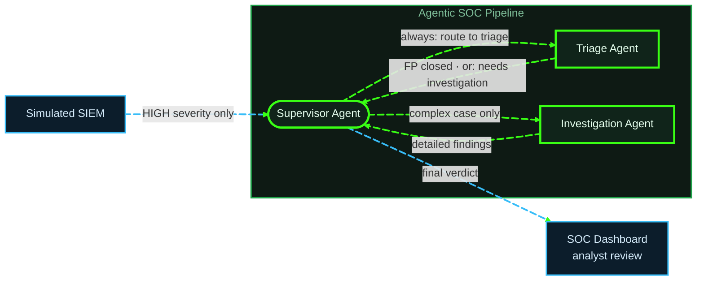

# SOC Agent — Pipeline Structure

## End-to-End Overview

Where the agent pipeline sits in the wider detection stack.

```mermaid
%%{init: {"theme": "base", "themeVariables": {"background": "#0B0F14", "primaryColor": "#10241A", "primaryBorderColor": "#39FF14", "primaryTextColor": "#E6FFEE", "lineColor": "#39FF14", "edgeLabelBackground": "#0B0F14", "tertiaryColor": "#0E1A14", "fontFamily": "monospace", "fontSize": "14px"}, "flowchart": {"curve": "basis", "padding": 12}}%%

flowchart LR

    FLEET["Enterprise Fleet<br/>servers · laptops"]
    ES[("Elasticsearch<br/>alert feed index")]
    SIEMX["SIEM<br/>built-in detection rules<br/>classifies LOW · MEDIUM · HIGH"]

    DASH["SOC Dashboard"]
    ANALYST(["Human Security Analysts"])

    FLEET o1@--> |"telemetry · logs"| ES
    ES    o2@--> |"alert feed"| SIEMX
    SIEMX o2@--> |"HIGH severity only"| DASH
    DASH  o5@--> |"review · action"| ANALYST

    o1@{ animate: true }
    o2@{ animate: true }
    o4@{ animate: true }
    o5@{ animate: true }

    classDef core   fill:#10241A,stroke:#39FF14,stroke-width:3px,color:#E6FFEE
    classDef ext    fill:#0C1D2B,stroke:#38BDF8,stroke-width:2px,color:#D6ECFB
    classDef store  fill:#1A1533,stroke:#A78BFA,stroke-width:2px,color:#E4DBFF,stroke-dasharray:4 3
    classDef muted  fill:#1A1A1F,stroke:#6B7280,stroke-width:1.5px,color:#9CA3AF

    class PIPE core
    class FLEET,SIEMX,DASH,ANALYST ext
    class ES store

    linkStyle default stroke:#38BDF8,stroke-width:2.5px
    linkStyle 0 stroke:#A78BFA,stroke-width:2px
    linkStyle 2 stroke:#39FF14,stroke-width:3px
```

```mermaid
%%{init: {"theme": "base", "themeVariables": {"background": "#0B0F14", "primaryColor": "#10241A", "primaryBorderColor": "#39FF14", "primaryTextColor": "#E6FFEE", "lineColor": "#39FF14", "edgeLabelBackground": "#0B0F14", "tertiaryColor": "#0E1A14", "fontFamily": "monospace", "fontSize": "14px"}, "flowchart": {"curve": "basis", "padding": 12}}%%

flowchart LR

    FLEET["Enterprise Fleet<br/>servers · laptops"]
    ES[("Elasticsearch<br/>alert feed index")]
    SIEMX["SIEM<br/>built-in detection rules<br/>classifies LOW · MEDIUM · HIGH"]
    PIPE["Agentic SOC Pipeline<br/>supervisor · triage · investigation"]
    DASH["SOC Dashboard"]
    ANALYST(["Human Security Analysts"])

    FLEET o1@--> |"telemetry · logs"| ES
    ES    o2@--> |"alert feed"| SIEMX
    SIEMX o3@--> |"HIGH severity only"| PIPE
    PIPE  o4@--> |"final verdict"| DASH
    DASH  o5@--> |"review · action"| ANALYST

    o1@{ animate: true }
    o2@{ animate: true }
    o3@{ animate: true }
    o4@{ animate: true }
    o5@{ animate: true }

    classDef core   fill:#10241A,stroke:#39FF14,stroke-width:3px,color:#E6FFEE
    classDef ext    fill:#0C1D2B,stroke:#38BDF8,stroke-width:2px,color:#D6ECFB
    classDef store  fill:#1A1533,stroke:#A78BFA,stroke-width:2px,color:#E4DBFF,stroke-dasharray:4 3
    classDef muted  fill:#1A1A1F,stroke:#6B7280,stroke-width:1.5px,color:#9CA3AF

    class PIPE core
    class FLEET,SIEMX,DASH,ANALYST ext
    class ES store

    linkStyle default stroke:#38BDF8,stroke-width:2.5px
    linkStyle 0 stroke:#A78BFA,stroke-width:2px
    linkStyle 2 stroke:#39FF14,stroke-width:3px
```

LOW and MEDIUM alerts never reach the pipeline — they stay in the SIEM for scheduled
review or automated rules. The green box is expanded below.

## Agent Pipeline Detail

---

